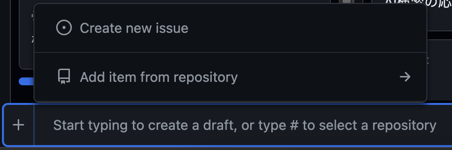
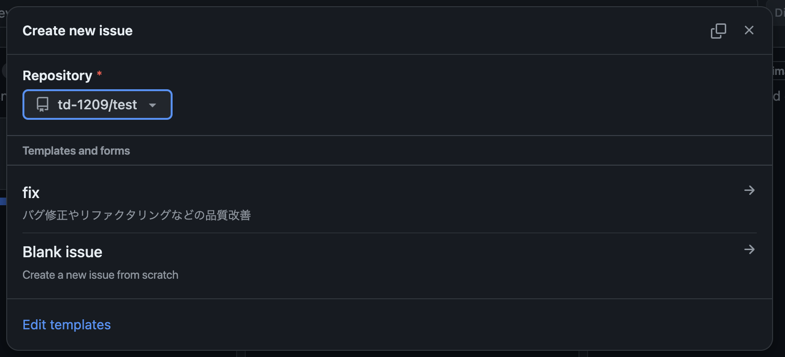

## Admin

### プロジェクト作成
1. repositoryとproject(Kanban)を作成。
    1. 両方ともprivateとし、projectはrepositoryと同名でOK。
1. mainブランチ・developブランチを作成し、削除不可のルールを付与。
1. repositoryとprojectにメンバーを招待。
1. issueラベルおよびissue templateを以下にあるものに変更。

## Mantainer

### issue
#### 内容
実装したい機能の仕様や、発生したバグの再現方法などを記載。  
項目の詳細はissue templateに準拠。  
#### 運用
起票はproject(Kanban)から実施し、プロジェクト関連の全てのタスクを起票。  
その際、開発関連のものはissue、それ以外(勉強・調査・検討など)はdraftとして起票。  
また、issue起票の場合は画像の「＋」ボタンから適切なissue templateを選択。  
  
  
※既にあるdraftをissueにする場合は、issue templateが使用できないため、手作業でコピペすること。 

#### ラベル
`feat`: 新機能追加  
`fix`: バグ修正  
`build`: ビルドシステムや外部依存関係に影響を与える変更（例：gulp, broccoli, npm）  
`ci`: CI設定ファイルとスクリプトの変更（例：CircleCi, SauceLabs）  
`docs`: ドキュメントのみの変更  
`perf`: パフォーマンスを改善するコード変更  
`refactor`: 機能追加やバグ修正に影響しないコード変更  
`test`: 不足しているテストの追加や既存のテストの修正  

---

### branch
#### 運用
フォーマット）`{ラベル}/{動詞から始まる具体的な開発内容}`  
例）`feat/implement_ai_recommendation`  
#### ラベル
`feat`: 新機能追加  
`fix`: バグ修正  
`build`: ビルドシステムや外部依存関係に影響を与える変更（例：gulp, broccoli, npm）  
`ci`: CI設定ファイルとスクリプトの変更（例：CircleCi, SauceLabs）  
`docs`: ドキュメントのみの変更  
`perf`: パフォーマンスを改善するコード変更  
`refactor`: 機能追加やバグ修正に影響しないコード変更  
`test`: 不足しているテストの追加や既存のテストの修正  

---

### PR
#### 内容
実装に必要な手順を記載。  
項目の詳細はpull request templateに準拠。  
#### 運用
`Draft`で作業・議論を行い、動作テストが完了したら`Ready for review`に変更。  

---

### コミット
#### 運用
2,3行変更したら1コミット。頻繁にプッシュし、マージ時にsquash。  
#### プッシュ時のコミットメッセージ
自由でOK。ただし特定のissueの解決を実施した場合は、  
コミットメッセージの接頭に`Closes #{issueNo}` を記載。（マージ時に該当issueが自動close）  
例）`Closes #3 ログイン時の表示不良対応`  
#### merge時のコミットメッセージ
全コミットをsquashし、適切なコミットメッセージを記載。  
フォーマット）`{ラベル}: {PRの本来の目的}`  
例）`feat: ログイン登録の実施`  
#### ラベル
`feat`: 新機能追加  
`fix`: バグ修正  
`build`: ビルドシステムや外部依存関係に影響を与える変更（例：gulp, broccoli, npm）  
`ci`: CI設定ファイルとスクリプトの変更（例：CircleCi, SauceLabs）  
`docs`: ドキュメントのみの変更  
`perf`: パフォーマンスを改善するコード変更  
`refactor`: 機能追加やバグ修正に影響しないコード変更  
`test`: 不足しているテストの追加や既存のテストの修正  

---

### 参考
1. [コミットとissueの紐付け](https://docs.github.com/ja/issues/tracking-your-work-with-issues/linking-a-pull-request-to-an-issue)
1. [コミットメッセージのテンプレ](https://www.conventionalcommits.org/ja/v1.0.0/)
1. [issueやPRのラベル](https://github.com/angular/angular.js/blob/master/DEVELOPERS.md#type)